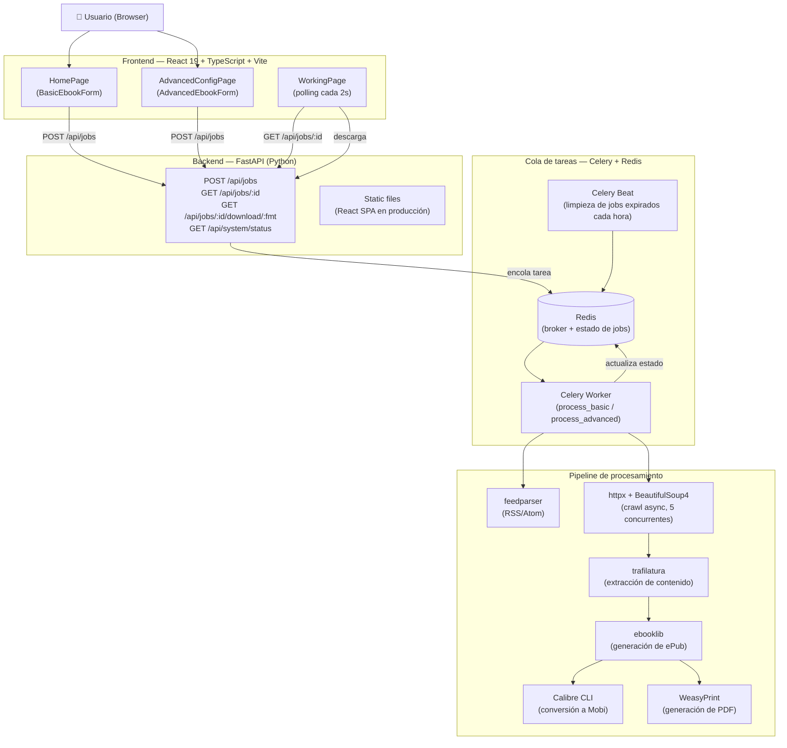

<div align="center">

# Bloxp Revived

**Convertí cualquier blog en un ebook descargable — ePub, Mobi o PDF.**

Una recreación moderna y open-source del [Bloxp](https://web.archive.org/web/20200812034023/http://www.bloxp.com/) original — una herramienta que desapareció de internet alrededor de 2020. Este proyecto la trae de vuelta con un stack contemporáneo, manteniendo su propósito original: darle una segunda vida a cualquier blog en formato portable y legible.

[](https://python.org)
[](https://fastapi.tiangolo.com)
[](https://react.dev)
[](https://www.typescriptlang.org)
[](https://tailwindcss.com)
[](https://redis.io)
[](https://docs.celeryq.dev)
[](LICENSE)

📖 **[Read in English](README.md)**

</div>

---

## La historia

El Bloxp original era una herramienta pequeña pero brillante. Pegabas la URL del feed RSS de un blog y, minutos después, tenías un archivo ePub o Mobi limpio con cada entrada que se había escrito — listo para leer en tu Kindle o e-reader. A diferencia de servicios similares que solo exportaban los posts más recientes, Bloxp recorría el archivo completo, desde la primera entrada hasta la última.

Desapareció de internet alrededor de 2020. Muchos de los blogs que ayudó a archivar también se fueron. Pero gracias a haber hecho conversiones con Bloxp antes de que desaparecieran, esas palabras todavía se pueden leer hoy — guardadas en silencio en archivos ePub en algún lugar.

Esta reimplementación estuvo pendiente durante mucho tiempo. Lo que finalmente lo hizo posible en unas pocas horas fue la aparición del desarrollo asistido por IA: una visión clara de lo que había que construir, y las herramientas para construirlo rápido.

> *Créditos y agradecimiento al proyecto Bloxp original y a su autor:*
> [bloxp.com/about](https://web.archive.org/web/20200812034023/http://www.bloxp.com/about.php)

---

## Funcionalidades

| Funcionalidad | Descripción |
|---------------|-------------|
| **Exportación por feed** | Pegá una URL RSS/Atom y exportá el archivo completo (hasta 250 posts) |
| **Modo avanzado** | Para blogs sin feed: proporcioná la URL del primer post + un selector CSS para navegar al "post anterior" |
| **Tres formatos de salida** | ePub (universal), Mobi (Kindle vía Calibre), PDF (vía WeasyPrint) |
| **Tabla de contenidos** | Opcional, generada automáticamente a partir de los títulos de los posts |
| **Links como notas al pie** | Conversión opcional de links inline a notas numeradas |
| **Contenido más limpio** | Mejor normalización de párrafos, manejo de verso/poesía y limpieza de bloques sociales/compartir |
| **Exportación con mejor media** | Mejor filtrado/descarga de imágenes y soporte para referencias de videos embebidos |
| **Procesamiento asíncrono** | Los trabajos corren en background vía Celery; el progreso se trackea en tiempo real |
| **Diagnóstico en tiempo real** | Línea de estado en el pie con versiones FE/BE, estado de Celery y tareas corriendo/en cola |
| **Limpieza automática** | Los archivos generados expiran después de 24 horas |

---

## Stack tecnológico

### Frontend

| Tecnología | Versión | Uso |
|------------|---------|-----|
| [React](https://react.dev) | 19 | Framework de UI |
| [TypeScript](https://www.typescriptlang.org) | 5.x | Tipado estático |
| [Vite](https://vitejs.dev) | 6.x | Build tool y servidor de desarrollo |
| [Tailwind CSS](https://tailwindcss.com) | v4 | Estilos utility-first |
| [React Router](https://reactrouter.com) | v7 | Routing client-side |
| [Zustand](https://zustand-demo.pmnd.rs) | 5.x | Estado de formularios |
| [TanStack Query](https://tanstack.com/query) | v5 | Estado del servidor y polling |

### Backend

| Tecnología | Versión | Uso |
|------------|---------|-----|
| [Python](https://python.org) | 3.12 | Runtime |
| [FastAPI](https://fastapi.tiangolo.com) | 0.115 | Framework REST API |
| [Celery](https://docs.celeryq.dev) | 5.x | Cola de tareas en background |
| [Redis](https://redis.io) | 7 | Broker + almacén de estado de jobs |
| [feedparser](https://feedparser.readthedocs.io) | 6.x | Parsing de RSS/Atom |
| [httpx](https://www.python-httpx.org) | 0.27 | Crawling HTTP asíncrono |
| [BeautifulSoup4](https://www.crummy.com/software/BeautifulSoup/) | 4.x | Parsing de HTML |
| [trafilatura](https://trafilatura.readthedocs.io) | 1.x | Extracción de contenido |
| [python-readability](https://github.com/buriy/python-readability) | — | Fallback de extracción de contenido |
| [ebooklib](https://github.com/aerkalov/ebooklib) | 0.18 | Generación de ePub |
| [Calibre CLI](https://calibre-ebook.com) | — | Conversión a Mobi (`ebook-convert`) |
| [WeasyPrint](https://weasyprint.org) | 62.x | Generación de PDF |

### Infraestructura

| Tecnología | Uso |
|------------|-----|
| [Docker Compose](https://docs.docker.com/compose/) | Entorno de desarrollo local |
| [Uvicorn](https://www.uvicorn.org) | Servidor ASGI |

---

## Arquitectura



---

## Inicio rápido

### Opción A — Docker Compose (recomendado)

```bash
git clone https://github.com/patchamama/bloxp-revived.git
cd bloxp-revived
docker compose up --build
```

Abrí **http://localhost:5173**

### Opción B — Local (sin Docker)

**Requisitos previos:** Node.js ≥ 18, Python ≥ 3.11, Redis

#### macOS

```bash
brew install redis node python
brew services start redis

git clone https://github.com/patchamama/bloxp-revived.git
cd bloxp-revived
chmod +x deploy.sh
./deploy.sh
```

#### Ubuntu / Debian Linux

`deploy.sh` instala Redis automáticamente si no está presente (requiere `sudo`).

```bash
# Instalar Node.js y Python si no están instalados
sudo apt-get update
sudo apt-get install -y nodejs npm python3 python3-venv python3-pip

git clone https://github.com/patchamama/bloxp-revived.git
cd bloxp-revived
chmod +x deploy.sh
./deploy.sh
```

> **Nota:** En el primer run puede pedirte la contraseña `sudo` para instalar y arrancar Redis.

#### Windows

Requiere Redis mediante una de estas opciones (en orden de preferencia):

- **[Memurai](https://www.memurai.com)** — servidor compatible con Redis nativo para Windows (recomendado)
- **WSL2** — `wsl sudo apt install redis-server && wsl sudo service redis-server start`
- **Docker Desktop** — el script lo arranca automáticamente si está disponible

```bat
git clone https://github.com/patchamama/bloxp-revived.git
cd bloxp-revived
deploy.bat
```

> **Nota:** En Windows, Celery usa el pool `solo` (`-P solo`) y uvicorn corre con un solo worker porque Windows no soporta `fork()`.

---

Abrí **http://localhost:8000** (o **http://localhost:8001** en WSL2 si el puerto 8000 está reservado por Hyper-V).

Para detener todos los servicios (Linux / macOS):
```bash
./stop.sh
```

#### Flags de deploy.sh / deploy.bat

| Flag | Descripción |
|------|-------------|
| `--no-build` | Omitir el build del frontend, reutilizar `frontend/dist/` existente |
| `--no-venv` | Omitir la creación del venv, asumir que ya existe |
| `--help` | Mostrar uso |

---

## Estructura del proyecto

```
bloxp-revived/
├── frontend/                  # React 19 SPA
│   └── src/
│       ├── pages/             # HomePage, AdvancedConfigPage, WorkingPage…
│       ├── components/        # Primitivos de UI + componentes de formulario
│       ├── hooks/             # useJobStatus, useSubmitJob
│       ├── stores/            # Zustand ebook store
│       └── api/               # Wrappers de fetch tipados
├── backend/                   # FastAPI + Celery
│   ├── main.py                # Entry point (sirve API + SPA en producción)
│   ├── routers/               # jobs, download, contact, system
│   ├── tasks/                 # process_blog (Celery), cleanup (beat)
│   ├── services/              # feed_parser, crawler, extractor, epub/mobi/pdf builders
│   ├── models/                # Modelos Pydantic (JobState, EbookOptions)
│   └── storage/               # Gestión de rutas de archivos
├── generated/                 # Ebooks de salida (auto-creado, gitignored)
├── logs/                      # Logs de servicios (auto-creado, gitignored)
├── deploy.sh                  # Script de deploy local en producción
├── stop.sh                    # Detener todos los servicios locales
├── docker-compose.yml         # Stack completo vía Docker
└── TODO.md                    # Roadmap y problemas conocidos
```

---

## Desarrollo

```bash
# Backend (con hot reload)
cd backend
python -m venv .venv && source .venv/bin/activate
pip install -r requirements.txt
uvicorn main:app --reload

# Celery worker (terminal separada)
celery -A tasks.celery_app worker --loglevel=info

# Frontend (terminal separada)
cd frontend
npm install && npm run dev
```

El servidor de desarrollo de Vite proxea las peticiones `/api/*` a `http://localhost:8000`.

---

## Variables de entorno

Copiá `.env.example` a `backend/.env` y ajustá según necesites:

| Variable | Default | Descripción |
|----------|---------|-------------|
| `REDIS_URL` | `redis://localhost:6379/0` | Cadena de conexión a Redis |
| `GENERATED_DIR` | `../generated` | Directorio para los ebooks de salida |
| `SMTP_HOST` | — | Servidor SMTP para el formulario de contacto (opcional) |
| `SMTP_PORT` | `587` | Puerto SMTP |
| `SMTP_USER` | — | Usuario SMTP |
| `SMTP_PASS` | — | Contraseña SMTP |

---

## API

| Método | Endpoint | Descripción |
|--------|----------|-------------|
| `POST` | `/api/jobs` | Crear un nuevo job de ebook |
| `GET` | `/api/jobs/:id` | Consultar estado y progreso del job |
| `GET` | `/api/jobs/:id/download/:format` | Descargar `epub`, `mobi` o `pdf` |
| `GET` | `/api/system/status` | Diagnóstico runtime (Celery, contadores en ejecución/en cola, versión backend) |
| `POST` | `/api/contact` | Enviar mensaje por el formulario de contacto |
| `GET` | `/api/health` | Health check |

### Límite de posts personalizado

Por defecto Bloxp obtiene hasta **250 posts** por job. Podés sobrescribir este límite agregando `?noMaxPosts` a la URL del blog que enviás:

| Parámetro | Límite |
|-----------|--------|
| *(sin parámetro)* | 250 posts |
| `?noMaxPosts=true` | 500 posts |
| `?noMaxPosts=150` | 150 posts (cualquier número) |

Ejemplo: `https://ejemplo.com/blog?noMaxPosts=true`

---

## Contribuir

Las pull requests son bienvenidas. Para cambios importantes, abrí un issue primero.
Mirá [TODO.md](TODO.md) para una lista de ideas y problemas conocidos.

---

## Licencia

[MIT](LICENSE)

---

## Agradecimientos

Este proyecto no existiría sin el **Bloxp** original de su autor anónimo.
Las librerías originales sobre las que fue construido están listadas en:
[bloxp.com/about](https://web.archive.org/web/20200812034023/http://www.bloxp.com/about.php)

La reconstrucción moderna se para sobre los hombros de:
feedparser · trafilatura · ebooklib · Calibre · WeasyPrint · FastAPI · Celery · React · Tailwind CSS · y muchos otros.
