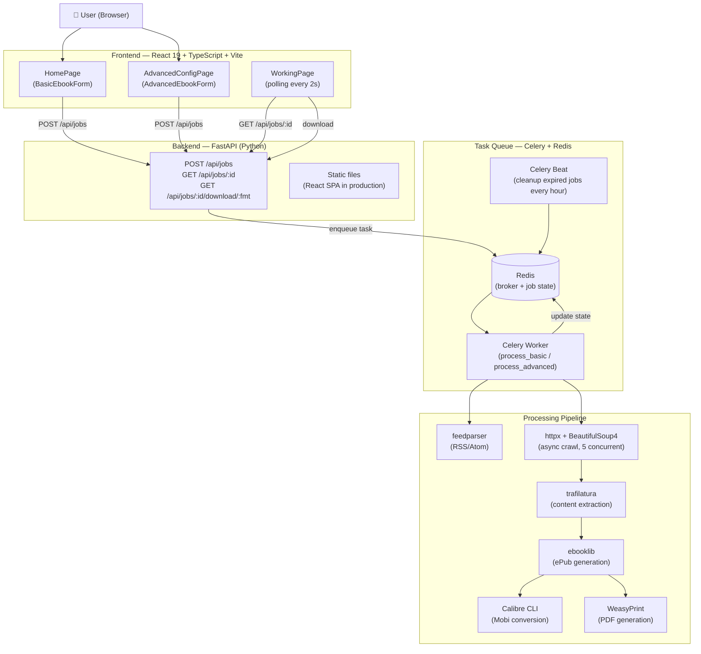

# Bloxp Revived

> **Convert any blog into a downloadable ebook — ePub, Mobi, or PDF.**

A modern open-source recreation of the original [Bloxp](https://web.archive.org/web/20200812034023/http://www.bloxp.com/) — a tool that has since disappeared from the internet. This project brings it back with a contemporary stack while preserving its original purpose: give any blog a second life as a readable, portable ebook.

---

## The Story

The original Bloxp was a small but brilliant tool. You pasted a blog's RSS feed URL and, minutes later, you had a clean ePub or Mobi file containing every post ever written — ready to read on your Kindle or e-reader. Unlike similar services that only exported the most recent posts, Bloxp crawled the full archive, from the very first entry to the last.

It disappeared from the internet sometime around 2020. Many of the blogs it helped archive are also gone now. But thanks to having converted them with Bloxp before they vanished, those words are still readable today — stored quietly in ePub files somewhere.

This reimplementation has been on a to-do list for a long time. What finally made it possible in just a few hours was the emergence of AI-assisted development: a clear vision of what needed to be built, and the tools to build it fast.

> *Credits and gratitude to the original Bloxp project and its author:*
> [bloxp.com/about](https://web.archive.org/web/20200812034023/http://www.bloxp.com/about.php)

📖 **[Leer en español](README.es.md)**

---

## Features

- **Feed-based export** — paste an RSS/Atom URL and export the full archive (up to 250 posts)
- **Advanced mode** — for blogs without feeds: provide the first post URL and a CSS selector for "previous post" navigation
- **Three output formats** — ePub (universal), Mobi (Kindle via Calibre), PDF (via WeasyPrint)
- **Table of contents** — optional, auto-generated from post titles
- **Links to footnotes** — optional conversion of inline links to numbered footnotes
- **Async processing** — jobs run in the background via Celery; progress tracked in real time
- **Auto cleanup** — generated files expire after 24 hours

---

## Architecture



### Stack

| Layer | Technology |
|-------|-----------|
| Frontend | React 19 + TypeScript + Vite + Tailwind CSS v4 |
| State | Zustand (forms) + TanStack Query (server state) |
| Routing | React Router v7 |
| Backend | Python 3.12 + FastAPI |
| Task queue | Celery 5 + Redis 7 |
| Feed parsing | feedparser |
| Web crawling | httpx (async) + BeautifulSoup4 |
| Content extraction | trafilatura + python-readability (fallback) |
| ePub generation | ebooklib |
| Mobi conversion | Calibre CLI (`ebook-convert`) |
| PDF generation | WeasyPrint |
| Dev environment | Docker Compose |

---

## Quick Start

### Option A — Docker Compose (recommended)

```bash
git clone https://github.com/patchamama/bloxp-revived.git
cd bloxp-revived
docker compose up --build
```

Open **http://localhost:5173**

### Option B — Local (no Docker)

**Prerequisites:** Node.js ≥ 18, Python ≥ 3.11, Redis

```bash
# macOS
brew install redis node python
brew services start redis

# Clone
git clone https://github.com/patchamama/bloxp-revived.git
cd bloxp-revived

# Build + deploy (single command)
chmod +x deploy.sh
./deploy.sh
```

Open **http://localhost:8000**

To stop all services:
```bash
./stop.sh
```

#### deploy.sh flags

| Flag | Description |
|------|-------------|
| `--no-build` | Skip frontend build, reuse existing `frontend/dist/` |
| `--no-venv` | Skip venv creation, assume it already exists |
| `--help` | Show usage |

---

## Project Structure

```
bloxp-revived/
├── frontend/                  # React 19 SPA
│   └── src/
│       ├── pages/             # HomePage, AdvancedConfigPage, WorkingPage…
│       ├── components/        # UI primitives + form components
│       ├── hooks/             # useJobStatus, useSubmitJob
│       ├── stores/            # Zustand ebook store
│       └── api/               # Typed fetch wrappers
├── backend/                   # FastAPI + Celery
│   ├── main.py                # App entry point (serves API + SPA in production)
│   ├── routers/               # jobs, download, contact
│   ├── tasks/                 # process_blog (Celery), cleanup (beat)
│   ├── services/              # feed_parser, crawler, extractor, epub/mobi/pdf builders
│   ├── models/                # Pydantic models (JobState, EbookOptions)
│   └── storage/               # File path management
├── generated/                 # Output ebooks (auto-created, gitignored)
├── logs/                      # Service logs (auto-created, gitignored)
├── deploy.sh                  # Local production deploy script
├── stop.sh                    # Stop all local services
├── docker-compose.yml         # Full stack via Docker
├── TODO.md                    # Roadmap and known issues
└── README.es.md               # Spanish documentation
```

---

## Development

```bash
# Backend (with hot reload)
cd backend
python -m venv .venv && source .venv/bin/activate
pip install -r requirements.txt
uvicorn main:app --reload

# Celery worker (separate terminal)
celery -A tasks.celery_app worker --loglevel=info

# Frontend (separate terminal)
cd frontend
npm install && npm run dev
```

The Vite dev server proxies `/api/*` requests to `http://localhost:8000`.

---

## Environment Variables

Copy `.env.example` to `backend/.env` and adjust:

| Variable | Default | Description |
|----------|---------|-------------|
| `REDIS_URL` | `redis://localhost:6379/0` | Redis connection string |
| `GENERATED_DIR` | `../generated` | Directory for output ebooks |
| `SMTP_HOST` | — | SMTP server for contact form (optional) |
| `SMTP_PORT` | `587` | SMTP port |
| `SMTP_USER` | — | SMTP username |
| `SMTP_PASS` | — | SMTP password |

---

## Contributing

Pull requests are welcome. For major changes, please open an issue first.
See [TODO.md](TODO.md) for a list of ideas and known issues.

---

## License

MIT

---

## Acknowledgements

This project would not exist without the original **Bloxp** by its anonymous author.
The original libraries it was built upon are listed at:
[bloxp.com/about](https://web.archive.org/web/20200812034023/http://www.bloxp.com/about.php)

The modern rebuild stands on the shoulders of:
feedparser · trafilatura · ebooklib · Calibre · WeasyPrint · FastAPI · Celery · React · Tailwind CSS · and many others.
