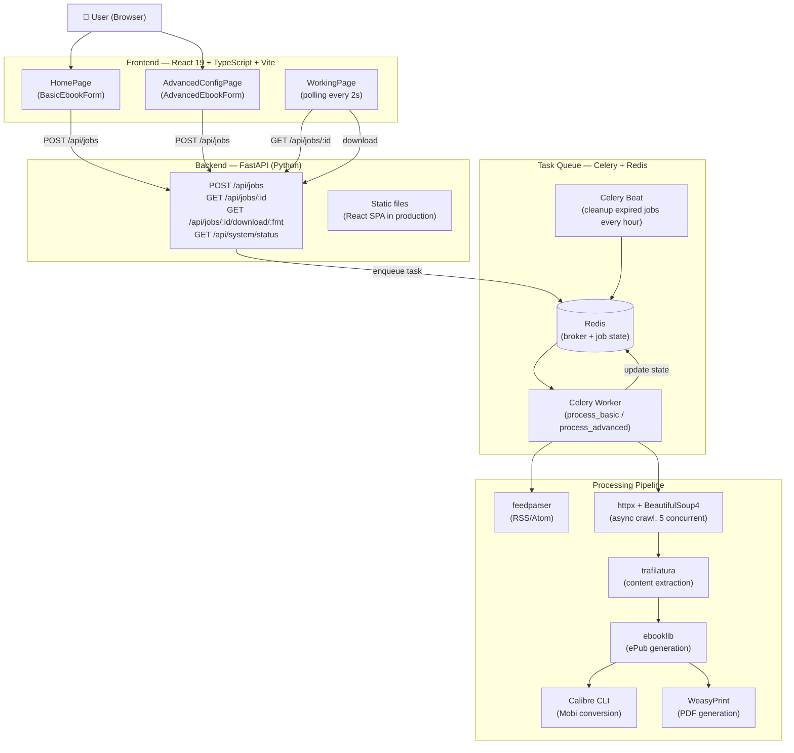

<div align="center">

# Bloxp Revived

**Convert any blog into a downloadable ebook — ePub, Mobi, or PDF.**

A modern open-source recreation of the original [Bloxp](https://web.archive.org/web/20200812034023/http://www.bloxp.com/) — a tool that disappeared from the internet around 2020. This project brings it back with a contemporary stack while preserving its original purpose: give any blog a second life as a readable, portable ebook.

[](https://python.org)
[](https://fastapi.tiangolo.com)
[](https://react.dev)
[](https://www.typescriptlang.org)
[](https://tailwindcss.com)
[](https://redis.io)
[](https://docs.celeryq.dev)
[](LICENSE)

📖 **[Leer en español](README.es.md)**

</div>

---

## The Story

The original Bloxp was a small but brilliant tool. You pasted a blog's RSS feed URL and, minutes later, you had a clean ePub or Mobi file containing every post ever written — ready to read on your Kindle or e-reader. Unlike similar services that only exported the most recent posts, Bloxp crawled the full archive, from the very first entry to the last.

It disappeared from the internet sometime around 2020. Many of the blogs it helped archive are also gone now. But thanks to having converted them with Bloxp before they vanished, those words are still readable today — stored quietly in ePub files somewhere.

This reimplementation has been on a to-do list for a long time. What finally made it possible in just a few hours was the emergence of AI-assisted development: a clear vision of what needed to be built, and the tools to build it fast.

> *Credits and gratitude to the original Bloxp project and its author:*
> [bloxp.com/about](https://web.archive.org/web/20200812034023/http://www.bloxp.com/about.php)

---

## Features

| Feature | Description |
|---------|-------------|
| **Feed-based export** | Paste an RSS/Atom URL and export the full archive (up to 250 posts) |
| **Advanced mode** | For blogs without feeds: provide the first post URL + a CSS selector for "previous post" navigation |
| **Three output formats** | ePub (universal), Mobi (Kindle via Calibre), PDF (via WeasyPrint) |
| **Table of contents** | Optional, auto-generated from post titles |
| **Links to footnotes** | Optional conversion of inline links to numbered footnotes |
| **Cleaner blog content** | Improved paragraph normalization, verse/poem handling, and social/share block cleanup |
| **Media-aware export** | Better image filtering/fetching and support for embedded video references |
| **Async processing** | Jobs run in the background via Celery; progress tracked in real time |
| **Runtime diagnostics** | Footer status line with FE/BE versions, Celery online state, running and queued tasks |
| **24h page cache** | Raw blog pages are cached in Redis for 24h and reused across jobs/workers/users |
| **Admin tools (dev/testing)** | Login-protected admin panel to inspect cache, Redis/Celery status, and stored ebooks |
| **Auto cleanup** | Generated files expire after 24 hours |

---

## Tech Stack

### Frontend

| Technology | Version | Purpose |
|------------|---------|---------|
| [React](https://react.dev) | 19 | UI framework |
| [TypeScript](https://www.typescriptlang.org) | 5.x | Type safety |
| [Vite](https://vitejs.dev) | 6.x | Build tool & dev server |
| [Tailwind CSS](https://tailwindcss.com) | v4 | Utility-first styling |
| [React Router](https://reactrouter.com) | v7 | Client-side routing |
| [Zustand](https://zustand-demo.pmnd.rs) | 5.x | Form state management |
| [TanStack Query](https://tanstack.com/query) | v5 | Server state & polling |

### Backend

| Technology | Version | Purpose |
|------------|---------|---------|
| [Python](https://python.org) | 3.12 | Runtime |
| [FastAPI](https://fastapi.tiangolo.com) | 0.115 | REST API framework |
| [Celery](https://docs.celeryq.dev) | 5.x | Background task queue |
| [Redis](https://redis.io) | 7 | Broker + job state store |
| [feedparser](https://feedparser.readthedocs.io) | 6.x | RSS/Atom parsing |
| [httpx](https://www.python-httpx.org) | 0.27 | Async HTTP crawling |
| [BeautifulSoup4](https://www.crummy.com/software/BeautifulSoup/) | 4.x | HTML parsing |
| [trafilatura](https://trafilatura.readthedocs.io) | 1.x | Content extraction |
| [python-readability](https://github.com/buriy/python-readability) | — | Content extraction fallback |
| [ebooklib](https://github.com/aerkalov/ebooklib) | 0.18 | ePub generation |
| [Calibre CLI](https://calibre-ebook.com) | — | Mobi conversion (`ebook-convert`) |
| [WeasyPrint](https://weasyprint.org) | 62.x | PDF generation |

### Infrastructure

| Technology | Purpose |
|------------|---------|
| [Docker Compose](https://docs.docker.com/compose/) | Local development environment |
| [Uvicorn](https://www.uvicorn.org) | ASGI server |

---

## Architecture



---

## Quick Start

### Option A — Docker Compose (recommended)

```bash
git clone https://github.com/patchamama/bloxp-revived.git
cd bloxp-revived
docker compose up --build
```

Open **http://localhost:5173**

### Option B — Local (no Docker)

**Prerequisites:** Node.js ≥ 18, Python ≥ 3.11, Redis

#### macOS

```bash
brew install redis node python
brew services start redis

git clone https://github.com/patchamama/bloxp-revived.git
cd bloxp-revived
chmod +x deploy.sh
./deploy.sh
```

#### Ubuntu / Debian Linux

Redis is installed automatically by `deploy.sh` if it is not present (requires `sudo`).

```bash
# Install Node.js and Python if needed
sudo apt-get update
sudo apt-get install -y nodejs npm python3 python3-venv python3-pip

git clone https://github.com/patchamama/bloxp-revived.git
cd bloxp-revived
chmod +x deploy.sh
./deploy.sh
```

> **Note:** The first run may ask for your `sudo` password to install and start Redis.

#### Windows

Requires one of the following for Redis (in order of preference):

- **[Memurai](https://www.memurai.com)** — Redis-compatible server native to Windows (recommended)
- **WSL2** — `wsl sudo apt install redis-server && wsl sudo service redis-server start`
- **Docker Desktop** — started automatically by the script if available

```bat
git clone https://github.com/patchamama/bloxp-revived.git
cd bloxp-revived
deploy.bat
```

> **Note:** On Windows, Celery uses the `solo` pool (`-P solo`) and uvicorn runs with a single worker because Windows does not support `fork()`.

---

Open **http://localhost:8282** (or **http://localhost:8282** on WSL2 if port 8282 is reserved by Hyper-V).

To stop all services (Linux / macOS):
```bash
./stop-local.sh
```

#### deploy.sh / deploy.bat flags

| Flag | Description |
|------|-------------|
| `--no-build` | Skip frontend build, reuse existing `frontend/dist/` |
| `--no-venv` | Skip venv creation, assume it already exists |
| `--help` | Show usage |

---

## Project Structure

```
bloxp-revived/
├── frontend/                  # React 19 SPA
│   └── src/
│       ├── pages/             # HomePage, AdvancedConfigPage, WorkingPage…
│       ├── components/        # UI primitives + form components
│       ├── hooks/             # useJobStatus, useSubmitJob
│       ├── stores/            # Zustand ebook store
│       └── api/               # Typed fetch wrappers
├── backend/                   # FastAPI + Celery
│   ├── main.py                # App entry point (serves API + SPA in production)
│   ├── routers/               # jobs, download, contact, system
│   ├── tasks/                 # process_blog (Celery), cleanup (beat)
│   ├── services/              # feed_parser, crawler, extractor, epub/mobi/pdf builders
│   ├── models/                # Pydantic models (JobState, EbookOptions)
│   └── storage/               # File path management
├── generated/                 # Output ebooks (auto-created, gitignored)
├── logs/                      # Service logs (auto-created, gitignored)
├── deploy.sh                  # Local production deploy script
├── stop-local.sh                    # Stop all local services
├── docker-compose.yml         # Full stack via Docker
└── TODO.md                    # Roadmap and known issues
```

---

## Development

```bash
# Backend (with hot reload)
cd backend
python -m venv .venv && source .venv/bin/activate
pip install -r requirements.txt
uvicorn main:app --reload

# Celery worker (separate terminal)
celery -A tasks.celery_app worker --loglevel=info

# Frontend (separate terminal)
cd frontend
npm install && npm run dev
```

The Vite dev server proxies `/api/*` requests to `http://localhost:8282`.

---

## Environment Variables

Copy `.env.example` to `backend/.env` and adjust:

| Variable | Default | Description |
|----------|---------|-------------|
| `MAX_POSTS_LIMIT` | `9999` | Global backend cap for `max_posts` and post ranges (used by Basic and Advanced) |
| `REDIS_URL` | `redis://localhost:6379/0` | Redis connection string |
| `GENERATED_DIR` | `../generated` | Directory for output ebooks |
| `SMTP_HOST` | — | SMTP server for contact form (optional) |
| `SMTP_PORT` | `587` | SMTP port |
| `SMTP_USER` | — | SMTP username |
| `SMTP_PASS` | — | SMTP password |

---

## API Reference

| Method | Endpoint | Description |
|--------|----------|-------------|
| `POST` | `/api/jobs` | Create a new ebook job |
| `GET` | `/api/jobs/:id` | Poll job status and progress |
| `GET` | `/api/jobs/:id/download/:format` | Download `epub`, `mobi`, or `pdf` |
| `DELETE` | `/api/jobs/:id` | Cancel/remove a job and cleanup generated artifacts |
| `GET` | `/api/system/status` | Runtime diagnostics (Celery, running/pending counters, backend version) |
| `POST` | `/api/contact` | Send a contact form message |
| `GET` | `/api/health` | Health check + dynamic config (`max_posts_limit`) |

### Admin API (dev/testing)

All admin endpoints require `Authorization: Bearer <token>` from `/api/admin/login`.

| Method | Endpoint | Description |
|--------|----------|-------------|
| `POST` | `/api/admin/login` | Admin login (default user in env example: `admin`) |
| `GET` | `/api/admin/status` | Redis/Celery status |
| `GET` | `/api/admin/cache/stats` | Global cache counters/size |
| `GET` | `/api/admin/cache/entries` | Cached page entries (url, ttl, size) |
| `DELETE` | `/api/admin/cache/entries/{key}` | Delete one cache entry |
| `GET` | `/api/admin/ebooks` | Stored ebook artifacts (paths, sizes, expiry metadata) |
| `DELETE` | `/api/admin/ebooks/{job_id}` | Delete/cancel a work and cleanup files |

### Add admin users from CLI

```bash
chmod +x add-admin-user.sh
./add-admin-user.sh <username> <password> [env_file]
# example
./add-admin-user.sh admin rayuela backend/.env
```

This updates `ADMIN_USERS_JSON` in the env file with PBKDF2-hashed credentials.

### Cache behavior when sites are down

- Crawlers read from Redis page cache first.
- If page/feed HTML is already cached and the site/network is down, generation continues from cache.
- Missing pages are fetched from network only when not already cached.

### Post limit override

By default Bloxp fetches up to **250 posts** per job. You can override this by appending `?noMaxPosts` to the blog URL you submit:

| Parameter | Limit |
|-----------|-------|
| *(not set)* | 250 posts |
| `?noMaxPosts=true` | 500 posts |
| `?noMaxPosts=150` | 150 posts (any number) |

Example: `https://example.com/blog?noMaxPosts=true`

---

## Contributing

Pull requests are welcome. For major changes, please open an issue first.
See [TODO.md](TODO.md) for a list of ideas and known issues.

---

## License

[MIT](LICENSE)

---

## Acknowledgements

This project would not exist without the original **Bloxp** by its anonymous author.
The original libraries it was built upon are listed at:
[bloxp.com/about](https://web.archive.org/web/20200812034023/http://www.bloxp.com/about.php)

The modern rebuild stands on the shoulders of:
feedparser · trafilatura · ebooklib · Calibre · WeasyPrint · FastAPI · Celery · React · Tailwind CSS · and many others.
